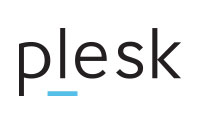

# Конспекты докладов с CodeFest X 

## Что это?

Конспекты и отзывы о докладах с конференции [CodeFest X](https://2019.codefest.ru).

Конспекты писали сотрудники компании [Plesk](https://www.plesk.com/). Добавляйте свои конспекты и дополняйте уже написанные. 

Заходите в чат [@ask_plesk](https://t.me/ask_plesk), чтобы познакомиться с командой и задать вопросы о Plesk.

## Список докладов

* [Командный и персональный рост в продукте: уроки, навыки и процессы](./source/team-and-personal-growth.md).
* [Эволюция цифрового общения](./source/digital-communication.md)
* [Додо в LeSS: как не заблудиться](./source/DODO.md)
* [Основные ошибки при проведении экспериментов](./source/Experiments%20and%20mistakes.md)
* [Moneyball. Как построить команду продактов, когда на рынке их нет](./source/Moneyball.md)
* [Сколько нужно энергии для работы Scrum Master, Product Owner и Agile Coach?](./source/PM%20Energy.md)
