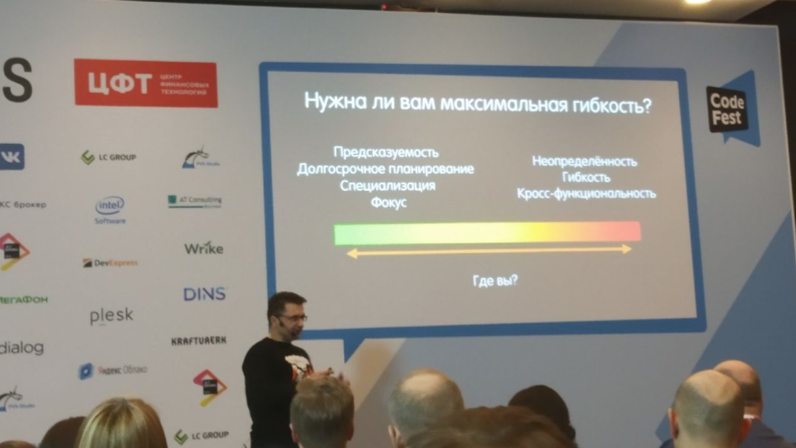

# Додо в LeSS: как не заблудиться

Антон Бевзюк, Додо Пицца.

## Мнение спикера

* “Мы знаем все про всех”. Какие именно фичи лучше у конкурентов, а что у нас.
* Наиболее эффективны “фича” команды. В команде должны быть все скилы для реализации и выпуска фичи. Делают все: от CustDev до Support.
* Оптимальный состав команды: 5 разработчиков (если один отсутствует по две пары для парного программирования), 1 QA, приходящий аналитик.
* Сначала делай по методичке, потом экспериментируй и создавай свое.
* Нет мудаков. Люди поступают лучшим из доступных способов.
* Даже самоорганизующейся команде нужен менеджер.

## Идеи

* Для любой активности или нововведения нужен owner на этапе внедрения и поддержки.
* Тренды (OKR) ДоДо: кастомизация, personalized marketing, delivery, open rating, tech debt.

## Ликбез + инструменты

[Less framework](https://less.works/less/framework/index.html) - [направление гибких методологий](https://scrumtrek.ru/blog/less-scrum-na-bolshih-masshtabah/), суть которого в применимости ко множеству команд, работающих над одним продуктом.

[Less huge](https://less.works/less/less-huge/index.html)

[Technical Excellence](https://less.works/less/technical-excellence/index.html)

[Mob programming](https://www.agilealliance.org/glossary/mob-programming) - вся команда работает над одной фичей в одно и то же время (часто за одним ноутбуком)

[Pair programming](https://www.agilealliance.org/glossary/pairing/)

[Sprint Review](https://less.works/less/scrum/sprint-review.html)

[PBR](https://less.works/less/framework/product-backlog-refinement.html)

[Design workshop](https://less.works/less/technical-excellence/architecture-design.html)

[Stop the line.](https://kanbanize.com/blog/stop-the-line/) Если релиз за отведенное время не произошел, вся команда фокусирует усилия на том, что протолкнуть релиз. Owner фокусируется на причинах сбоя релиза и нарабатывает best practices, чтобы приходить на помощь всем командам в схожих ситуациях.

[Behaviour-driven development (BDD)](https://www.agilealliance.org/glossary/bdd/)

[Test-driven development (TDD)](https://www.agilealliance.org/glossary/tdd/)

[Acceptance test driven development (ATDD)](https://www.agilealliance.org/glossary/atdd/)

[Data driven development](https://habr.com/ru/post/158277/)

[Domain driven development](https://habr.com/ru/post/158277/)

[Unit testing](https://en.wikipedia.org/wiki/Unit_testing)

## Ошибки

* Не понимать какой уровень гибкости действительно необходим компании.
Как определить потребность в гибком подходе? Наблюдать за частотой изменения бэклога.
* Не знать плюсов меньшей гибкости.
Меньшая гибкость позволяет: держать фокус, осуществлять долгосрочное планирование, наращивание экспертизы по специализации.

## Первоисточники

https://scrumguides.org/scrum-guide.html

https://less.works/
