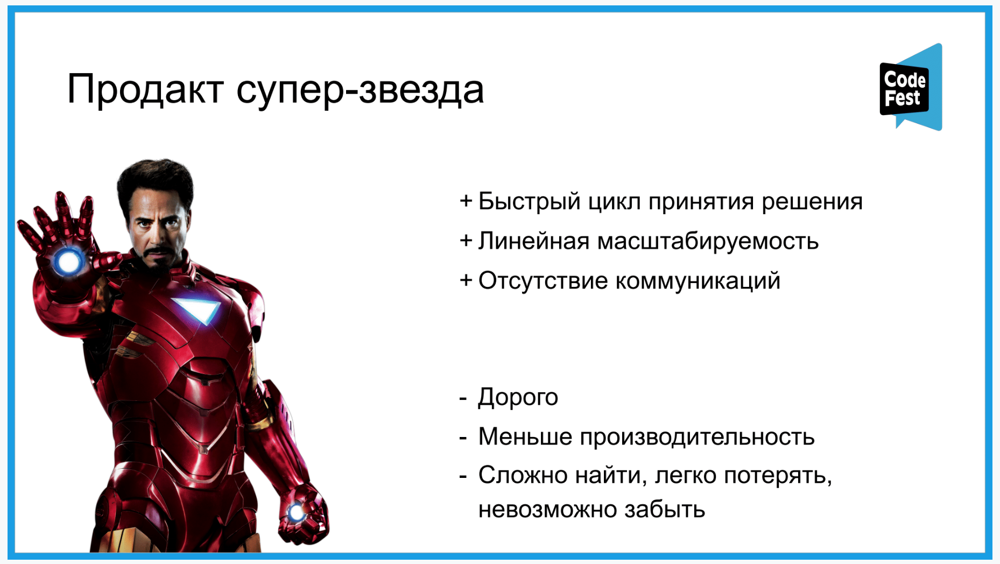
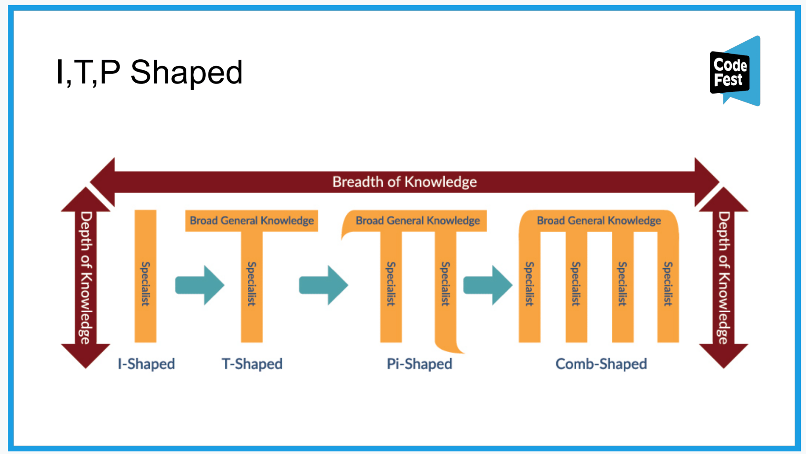
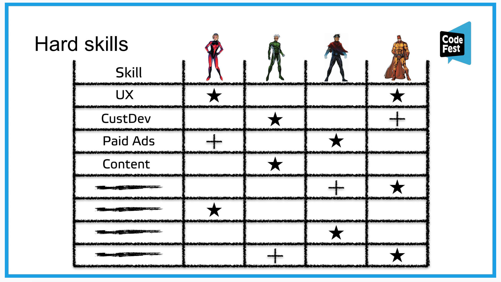

# Moneyball. Как построить команду продактов, когда на рынке их нет

Дмитрий Абрамов, Kaiten.

## Мнение спикера
* Оптимальный состав команды 4 человека.
* Команда из нескольких постоянно обучающихся Product managers может стоить как один Product manager superstar, а по эффективности превосходить.

* В команде можно вырастить middle Product manager за 1-2 года.
* Определяющий skillset PM не должен быть перенасыщенным.

## Идеи
Если есть сомнение, а нужен ли навык компании, пригласить эксперта (консалтинг) на 2 месяца, измерить до/после, принять решение.

## Ликбез
[I, T, Pi Shaped.](https://devopsinstitute.com/2017/11/15/from-i-shaped-to-t-shaped-why-devops-professionals-need-to-be-multi-skilled/)

## Инструменты

### 1. Hard-skills

Пример матрицы релевантных для компании Hard-skills.

### 2. Soft-skills PM

Выявляются на этапе интервьюирования в команду PM.

* Адекватность (для команды).
Выявить через case-интервью: как принимает решения; как реагирует на обратную связь.
* Обучаемость. Выявить через вопросы: как обучаешься, что / как применил.

* A-player. Об инициативности, ответственности, стремлении к росту и мотивации. “Горящие” глаза.

### 3. Визуализация продуктового процесса

Помнить через какие стадии должна проходить работа над гипотезой/ фичей.

### 4. Шаблон гипотезы

Помнить, что должна содержать гипотеза перед тем, как начинать с ней работать.

### 5. Проверка гипотезы на соответствие целей продукта

— Гипотеза соответствует цели А?  
— Нет.  
— Тогда зачем ее проверять?

### 6. Двухнедельные циклы освоения новых скиллов
С трекингом результатов: доклад (5-10 минут) + опыт применения (полученный / будущий).

