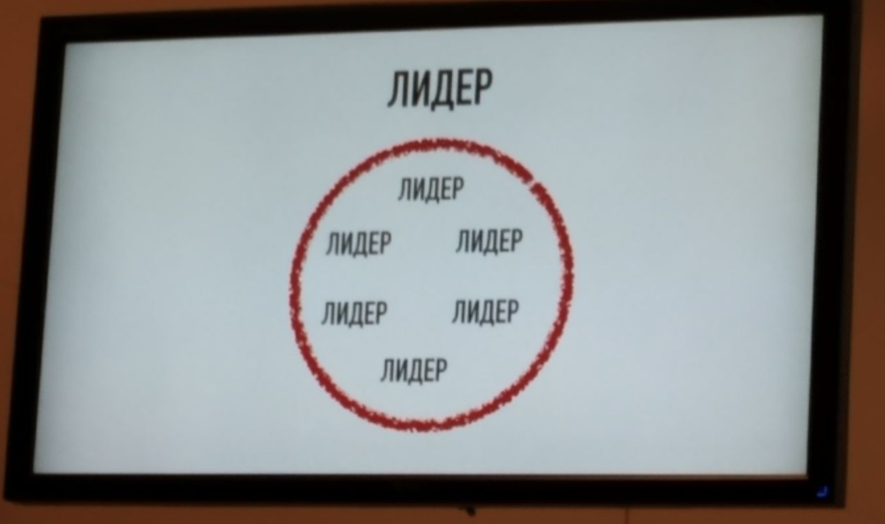
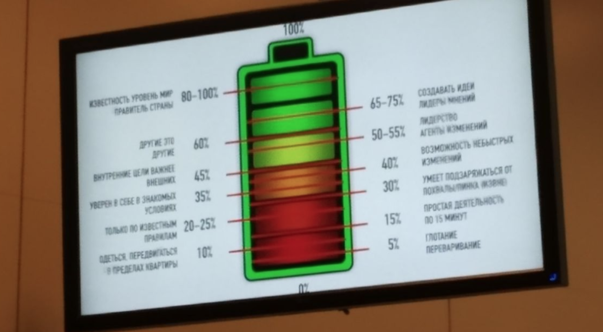

# Сколько нужно энергии для работы Scrum Master, Product Owner и Agile Coach?

Анна Обухова, Scrum Trek.

## Мнение спикера
* Меняется среда, меняется то, как люди работают.
* Применение coaching для людей с профессиональным выгоранием имеет обратный эффект - только хуже. Нейролидерство в помощь!

# Ликбез
* [Нейролидерство](https://www.forbes.ru/235790-mozg-pod-pricelom-kompanii) - термин ввел впервые Дэвид Рок в книге “Мозг. Инструкция по применению”.
* Пьер Касс. [Главное качество лидера - энергия, а не интеллект.](https://www.forbes.ru/column/48259-glavnoe-kachestvo-lidera-energiya-ne-intellekt)  Вводит понятие VQ (Vitality quotient).
В этом контексте спикер ставит в один ряд с IQ и EQ также и “коэффициент энергии”.

# Тезисы спикера
Сотрудникам лучше работается (лучше себя чувствуют) => повышается производительность.

Доказательная база через пример исследования с коровами: предоставили свободу передвижения, питания, режима => надой увеличился на 30%. 

Вывод спикера: команды предоставленные сами себе => потенциальный рост производительности.

Оговорка: Не достаточно чтобы в такой команде только лидер был лидером и обладал достаточной энергией. В команде все должны быть лидеры и обладать энергией.

### Процентометр энергии
<table>
    <tr>
        <td>% энергии</td>
        <td>Характеристики</td>
    </tr>
    <tr>
        <td>0</td>
        <td>Человек живой</td>
    </tr>
    <tr>
        <td>5</td>
        <td>Глотает, переваривает.</td>
    </tr>
    <tr>
        <td>10</td>
        <td>Одевается, передвигается.</td>
    </tr>        
    <tr>
        <td>15</td>
        <td>Не интеллектуальная деятельность (готовит еду).</td>
    </tr>
    <tr>
        <td>20-25</td>
        <td>Ручной труд, по правилам и инструкциям. Конвейер.</td>
    </tr>
    <tr>
        <td>30</td>
        <td>Может сам определить себе занятие без воздействия извне.
            Обучается, без возможности применениях игровых техник и творчества.
            Умеет заряжаться от пинка / похвалы.</td>
    </tr>
    <tr>
        <td>35</td>
        <td>Планирует время (успеваю/не успеваю).
            При изменениях впадает в панику. Не способен распознать положительные или негативные изменения, возможности и реагирует отказом.
            Уверен в себе в знакомых условиях.
            Умеет заряжаться от результатов и эстетики.
            Получает всплески энергии от тортиков и обнимашек, но организм энергию долго не удерживает.</td>
    </tr>
    <tr>
        <td>40</td>
        <td>Получает возможность руководства (не лидерства) благодаря стажу работы и исполнительности.
            Ощущает личные границы и не ввязывается в конфликты.
            Возможность не быстрых изменений.
            Может переключать деятельность по желанию - сила воли. “Сделаю трудное/важное сейчас”.
            Может повторить то, что уже делали.</td>
    </tr>
    <tr>
        <td>45</td>
        <td>Внутренние цели важнее внешних. Двигается к хорошему
            Возможность изменений. Имеет развитое абстрактное мышление, вкус, эстетика
            Может действовать не социально ожидаемо.
            Придумает как решить новую задачу.</td>
    </tr>        
    <tr>
        <td>50-55</td>
        <td>Лидер, топ-менеджер, агент изменений.
            Его слушают, за ним следуют.
            Имеет стабильные ресурсы энергии,
            Обладает индивидуальностью</td>
    </tr>
    <tr>
        <td>60</td>
        <td>Понимает, что другие - это другие и их не надо перевоспитывать. Минимальный уровень для коучей, психологов и т.д.</td>
    </tr>    
    <tr>
        <td>65-75</td>
        <td>Невозможность НЕ делать СВОЕ;
            Лидер мнений;
            Thought leadership;
            Новые продукты и идеи.</td>
    </tr>    
    <tr>
        <td>80-100</td>
        <td>Имеет вековую мировую известность; 
            Правитель страны;
            Петр I, Македонский, Гиппократ.</td>
    </tr>
</table>

Нужно заниматься работой, которая соответствует уровню энергии. Это способствует ее повышению. Пример, уровень энергии 20-25% - раскрасить раскраску.

В среднем офисные сотрудники находятся на уровне 33% энергии. В условиях изменений нужно хотя бы 40% энергии. 

Если средний уровень энергии команды от 45%-50%, могут быть применены гибкие методологии, например, SCRUM.

65-75% энергии - минимальный уровень для работы Product owners.

Нам нравятся люди, чей уровень энергии на 10% выше нашего. А если на 20-30% - то уже возникает непонимание.

При подборе Product manager должны оцениваться не только навыки, но и способность “подрасти” энергетически на 10-15%, и способность удержать такой уровень. 

### Компоненты лидерства
* Витальность (энтузиазм, выносливость).
Можно измерять в приложении [Welltory](https://welltory.com/ru/how-it-works/).
При низком показателе все другие к нему приравниваются.
* Примативность
Мои цели  > других целей. Крайность “+” наплевать на других, “-” живу для других.
* Ранговый потенциал.
Мне интересно > страшно. 
Много хочет и предвкушает. 
Зависит от уровня дофамина (врожденный потенциал) и тестостерона.
Если дать задачу не спросив и без возможности отказаться - уровень дофамина снижается.
Слишком высокий ранговый потенциал ведет к шизофрении и депрессиям.

Таким образом, уровень энергии определяет что можем, что хотим и как можем управлять.
