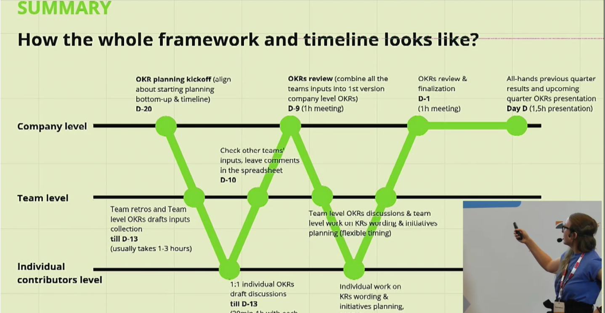
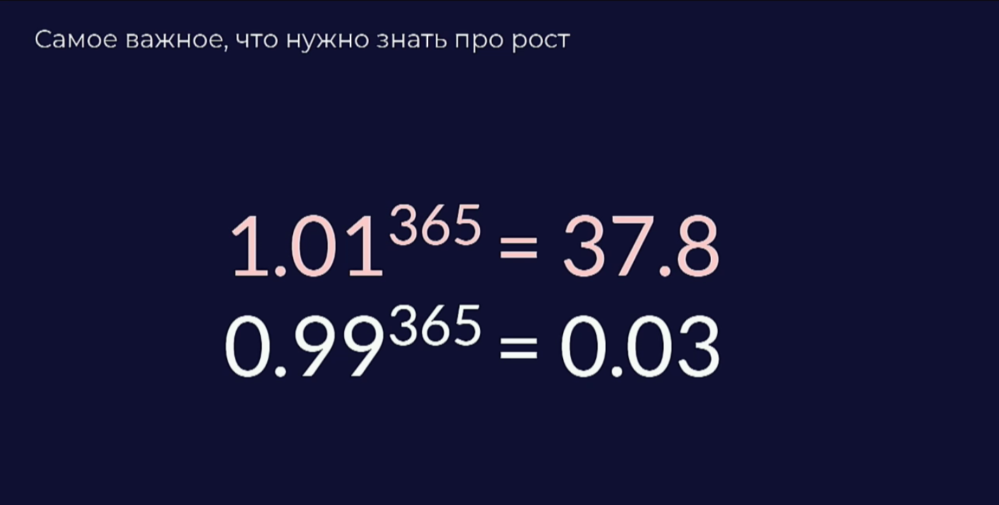

# Командный и персональный рост в продукте: уроки, навыки и процессы

Анна Бояркина, Miro (Realtime Board)

Продукт — платформа для коллаборации.
Продукт растет на 300% в год и вообще всё круто.
Повод поговорить о том, как живётся людям в быстрорастущих компаниях.

Изменения в компании происходят незаметно.
Когда компания только начинает, сотрудники сами себе покупают печеньки.
Потом их покупает компания, а потом появляется кофемашина. 
К счастью, это не всё, что меняется.
Но остальные изменения достаются трудом менеджеров.

## Рост команды

* 2011 — первые 11 человек. Продукт = команда.
* 2016 — 35-50 человек, первая структура и процессы, первые функции за пределами продукта и первый сотрудник в штатах.
* 2018 — 150 человек, одной командой уже невозможно сделать всё.

Точка роста: переход к командной модели подписки.

По мере роста команды появляются новые функции: саппорт, продажи, маркетинг, operations, customer success, PMO и так далее. 
Команда работает в разных частях мира.
Появляются люди с очень глубоким знанием конкретных процессов.

Что меняется при этом, какие вызовы?

* Зона ответственности становится более узкой.
  Исключение — когда человек растет карьерно.
* Компания может расти экспоненциально, но люди могут расти только линейно.
* Кто-то становится руководителем, кто-то остаётся делать задачи.
  Поэтому в менеджменте образуется пустота в середине.
  Нет тимлидов.
* Экспоненциально растут коммуникации. Сложно до всех дотянуться.
* Компания меняется каждый квартал, сложно привыкнуть к темпу.
* Появляется много формализованных процессов.
  При этом хочется не скатиться в бюрократию.
  
## Рост и продакт-менеджеры

В один прекрасный день в компании появляется первый продакт.
Это человек, который берёт видение основателя компании и начинает его активно реализовывать (экзекьютить).

Сейчас в Миро 10 продуктовых команд.
Есть ключевой продукт (6 команд и Labs) и есть команда роста (ещё 3 команды).

Задача команды роста — придумывать новое. 
Задача команды продукта — это новое масштабировать.

В компании появляются разные типы продактов:

* Starter создаёт новое из ничего. Основатель — как раз такой стартер.
* Scaler делает из чего-то обычного что-то большое.
* Steward поддерживет порядок.
* Sage — многогранный лидер, который владеет всеми четырьмя стилями.

Путь профессионального развития продакта:

1. Associate PM
1. PM
1. Senior PM
1. ветвление на два трека:
    * Principal PM
    * Product Director
    
Всё это подддерживается системой грейдов, матрицей компетенций и performance review.

## Навыки и качества менеджера продукта

На любом уровне:

* предпринимательское мышление
* коммуникации
* способность быстро учиться
* критическое мышление
* ориентация на результат
* внимание к деталям

Для дальнейшего роста

* знание того, как работает бизнес
* управление людьми, коучинг, найм и увольнение
* орг дизайн
* ...
* главное — делегирование!

Как развивать навык4и и вводить себя в нову34ю роль:

* 90-дневный план для новой роли
* общение с экспертами из отрасли
* поиск менторов и коученй
* профсообщества
* хорошие книги
* возможность учиться у коллег и руководителей 

## Процессы и практики

Проблемы, которые нужно решать в растущей компании

* общий контекст и понимание проблем
* постоянная обратная связь
* рост людей
* принятие решений на всех уровнях
* вовлечённость
* управляемость
* готовность к масштабированию

Полезные процессы и практики:

* стратегические сессии
* прозрачный процесс постановки целей и исполнения — ОКР
* коучинг и тренинги менеджмента
* формализация ключевых процессов: встречи, онбординг новичков, принципы коммуникаций и т.д.
* актуальная база знаний
* формализация культуры.

Культура — это не плакаты и футболки.
Культура — это то, как люди принимают решения.

Ценности:

* Dare to dream big and work hard
* Drive change and be open
* Embrace trust to turn failures into wins
* Play, as a team, to win the world
* Create better version of ourselves every day
* Yes to passion, no to bullshit

Коммуникационные практики в компании

* Презентации для всей компании
* Демо (Friday wins)
* Кросс-функциональные 
* Регулярные ревью (OKR раз в две недели)
* W-модель планирования
* Регулярные 1:1

W-модель планирования выглядит так:

Коммуникации в продуктовой команде:

* Product insights — делимся фидбеком от пользователей
* Product review — как код-ревью, только для продактов
* Product talk — обсуждаем общие задачи и подходы

## Ключевые выводы

* Рост — это хорошо, но для людей он может быть некомфортным
* Компании могут расти экспоненциально, но люди — только линейно
* Коммуникации и создание общего понимания — это один из главных вызовов
* Сначала от людей нужно слабоумие и отвага. На этапе роста важно, чтобы в людях было много отваги и мало слабоумия. 

## Самое главное

## Вопросы

Q: А как продакту расти быстрее, чем линейно?  
A: Очень много пробовать и ошибаться.

Q: Что с новыми сотрудниками?
A: Есть онбординг в команду, отдельный отбординг в культурный код.
   Просто много разговариваем с людьми и даём фидбек.
   Про достижения пишем в слак.
